# 🖥️ device_systems API

API REST para gestión de usuarios construida con **FastAPI** y **Pydantic v2**.

---

## 📋 Descripción

`device_systems` es una API REST que permite administrar usuarios del sistema.
Implementa un CRUD completo con validaciones, manejo de errores, códigos HTTP
correctos, Dependency Injection y documentación automática con Swagger/OpenAPI.

---

## 🛠️ Tecnologías utilizadas

- Python 3.11+
- FastAPI 0.110+
- Uvicorn
- Pydantic v2
- Git & GitHub

---

## ⚙️ Instalación

```bash
git clone https://github.com/KelinMontoya/device_systems.git
cd device_systems
pip install -r requirements.txt
```

---

## ▶️ Ejecución

```bash
uvicorn app.main:app --reload
```

- Swagger UI → http://127.0.0.1:8000/docs  
- ReDoc      → http://127.0.0.1:8000/redoc

---

## 📁 Estructura del proyecto

DEVICE_SYSTEMS/
├── app/
│   ├── data/
│   │   ├── __init__.py
│   │   └── users_db.py
│   ├── dependencies/
│   │   ├── __init__.py
│   │   └── user_dependencies.py
│   ├── routes/
│   │   └── user_routes.py
│   ├── schemas/
│   │   └── user_schema.py
│   ├── services/
│   │   ├── __init__.py
│   │   └── user_service.py
│   └── main.py
├── Captura/
│   └── 1.png
├── .gitignore
├── README.md
└── requirements.txt

---

## 📌 Tabla de endpoints

| Método | Ruta | Descripción | Código |
|--------|------|-------------|--------|
| GET | /users | Listar todos los usuarios | 200 |
| GET | /users?role=admin | Filtrar por rol | 200 |
| GET | /users?is_active=true | Filtrar por estado | 200 |
| GET | /users/{id} | Obtener usuario por ID | 200 |
| POST | /users | Crear nuevo usuario | 201 |
| PUT | /users/{id} | Actualizar usuario completo | 200 |
| PATCH | /users/{id} | Actualizar usuario parcial | 200 |
| DELETE | /users/{id} | Eliminar usuario | 204 |

---

## 📤 Ejemplos de peticiones

### POST /users
```json
{
  "name": "Sofia Leon",
  "email": "sofia@mail.com",
  "role": "support",
  "is_active": true
}
```

### PUT /users/1
```json
{
  "name": "Ana Torres Updated",
  "email": "ana@mail.com",
  "role": "admin",
  "is_active": true
}
```

### PATCH /users/1
```json
{
  "role": "support"
}
```

---

## 🔢 Códigos de estado HTTP

| Código | Significado | Cuándo ocurre |
|--------|-------------|---------------|
| 200 | OK | GET, PUT, PATCH exitosos |
| 201 | Created | POST exitoso |
| 204 | No Content | DELETE exitoso |
| 400 | Bad Request | Email duplicado, PATCH vacío |
| 404 | Not Found | Usuario no existe |
| 422 | Unprocessable Entity | Datos inválidos (Pydantic) |

---

## 🔗 Cabeceras HTTP personalizadas

Todos los endpoints retornan:
X-App-Name: device_systems
X-API-Version: 2.0

---

## 🧩 Dependency Injection con Depends()

Se crearon dependencias reutilizables en `app/dependencies/user_dependencies.py`:

- **`get_user_or_404`** → Busca el usuario por ID. Si no existe lanza 404 automáticamente.
  Se usa en GET por ID, PUT, PATCH y DELETE para no repetir esa lógica en cada endpoint.

- **`verify_api_key`** → Valida la cabecera `X-API-Key` para simular autenticación.

- **`get_api_config`** → Retorna la configuración general de la app.

Ejemplo de uso en una ruta:
```python
@router.delete("/{user_id}", status_code=204)
def delete_user(
    user_id: int,
    _user: dict = Depends(get_user_or_404)
):
    user_service.delete_user(user_id)
```

---

## ❌ Manejo de errores

La API controla los siguientes errores con `HTTPException`:

| Error | Código | Mensaje |
|-------|--------|---------|
| Usuario no encontrado | 404 | "Usuario con id=X no encontrado" |
| Correo duplicado | 400 | "El correo ya está registrado" |
| PATCH sin campos | 400 | "Debes enviar al menos un campo" |
| Datos inválidos | 422 | Detalle automático de Pydantic |

---

## 📸 Evidencias Swagger UI

### Pantalla principal — todos los endpoints
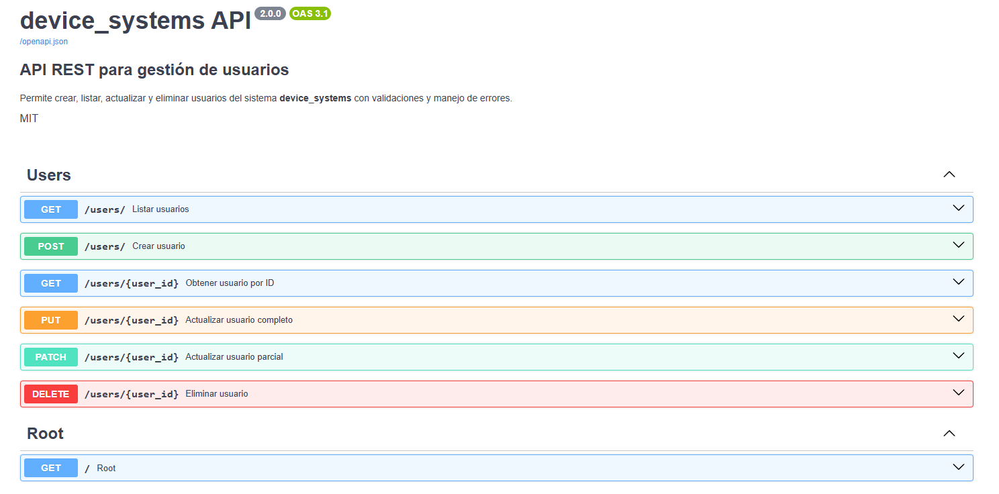

### GET /users — lista completa
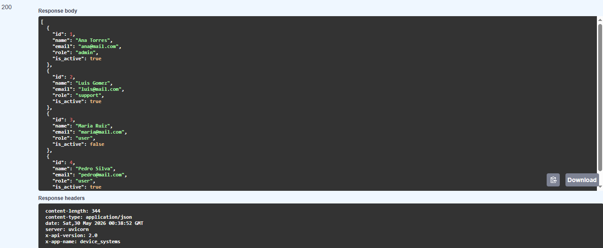

### GET /users/{id} — usuario encontrado
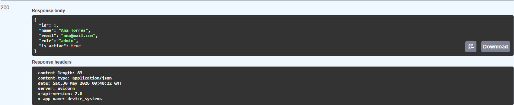

### GET /users/{id} — error 404
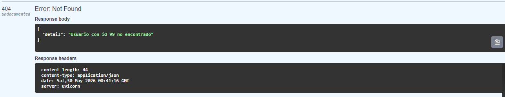

### POST /users — usuario creado exitosamente
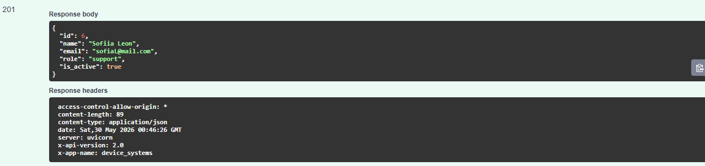

### POST /users — error 400 correo duplicado
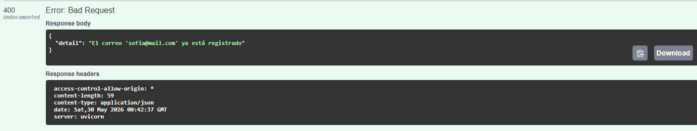

### POST /users — error 422 validación Pydantic
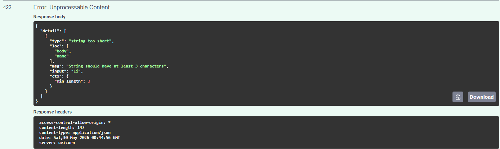

### PUT /users/{id} — actualización completa
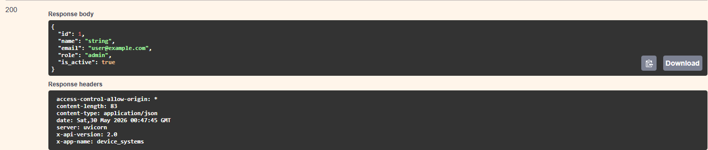

### PATCH /users/{id} — actualización parcial
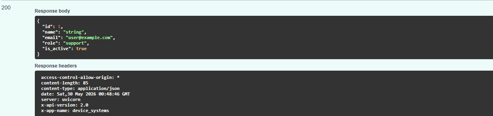

### PATCH /users/{id} — error 400 body vacío
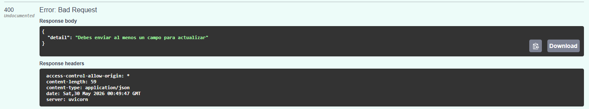

### DELETE /users/{id} — eliminación exitosa


### DELETE /users/{id} — error 404
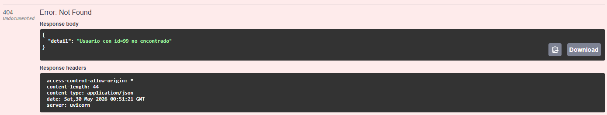

### ReDoc — documentación completa
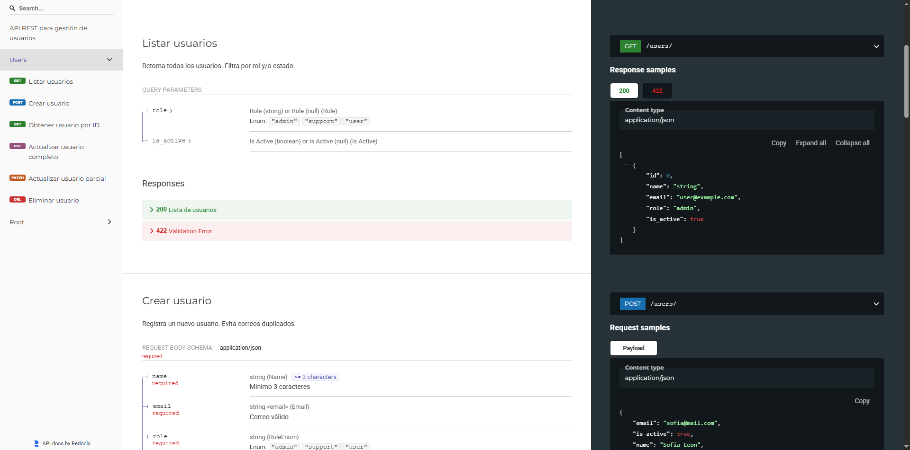

---

## 💡 Reflexión final

FastAPI permite construir APIs REST de forma rápida, segura y bien documentada.
El uso de Pydantic v2 garantiza validaciones automáticas en cada entrada de datos,
mientras que `Depends()` evita repetir lógica en cada endpoint, haciendo el código
más limpio y fácil de mantener. La documentación automática con Swagger/OpenAPI
es una ventaja enorme para probar y compartir la API sin herramientas adicionales.

