# device_systems API — v3.0 (SQLAlchemy + SQLite)

API REST para gestión de usuarios construida con **FastAPI**, **SQLAlchemy** y **SQLite**.

---

## Estructura del proyecto

```
device_systems/
│── app/
│   │── main.py                          # Punto de entrada, crea tablas al iniciar
│   │
│   │── database/
│   │   └── connection.py                # engine, SessionLocal, Base
│   │
│   │── models/
│   │   └── user_model.py                # Modelo SQLAlchemy (tabla users)
│   │
│   │── schemas/
│   │   └── user_schema.py               # Schemas Pydantic (entrada/salida)
│   │
│   │── routes/
│   │   └── user_routes.py               # Endpoints del recurso /users
│   │
│   │── services/
│   │   └── user_service.py              # Lógica CRUD con base de datos
│   │
│   └── dependencies/
│       └── database_dependency.py       # Dependencia get_db() para sesiones
│
│── requirements.txt
└── README.md
```

---

## Instalación y ejecución

```bash
pip install -r requirements.txt
uvicorn app.main:app --reload
```

Documentación disponible en:
- **Swagger UI:** http://localhost:8000/docs
- **ReDoc:** http://localhost:8000/redoc

---

## Endpoints disponibles

| Método | Ruta              | Descripción                        | Código |
|--------|-------------------|------------------------------------|--------|
| GET    | /users            | Listar usuarios (filtros opcionales)| 200   |
| GET    | /users/{id}       | Buscar usuario por ID              | 200    |
| POST   | /users            | Crear nuevo usuario                | 201    |
| PUT    | /users/{id}       | Actualizar usuario completo        | 200    |
| PATCH  | /users/{id}       | Actualizar usuario parcial         | 200    |
| DELETE | /users/{id}       | Eliminar usuario                   | 204    |

### Parámetros de filtro en GET /users
- `role`: admin | support | user
- `is_active`: true | false
- `order_by`: id | name | created_at

---

### CAPTURAS

## Estructura del proyecto

## Estructura del proyecto
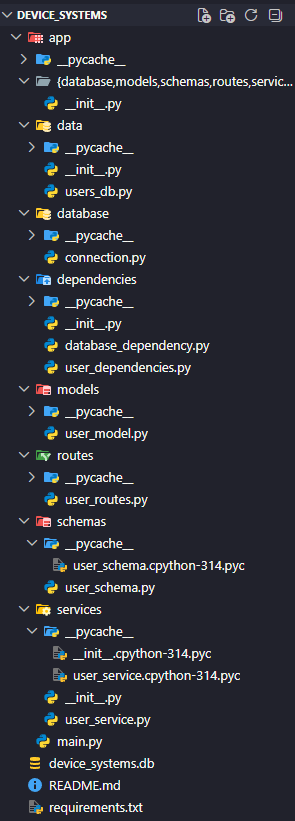

## Base de datos - Tabla users
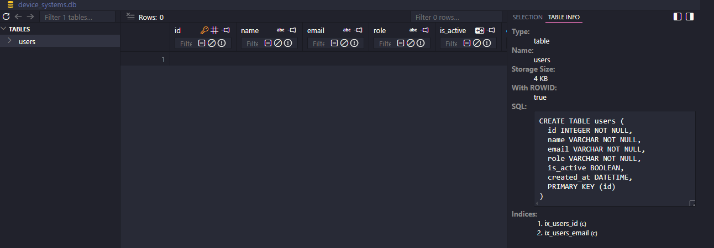

## Swagger UI - Página principal
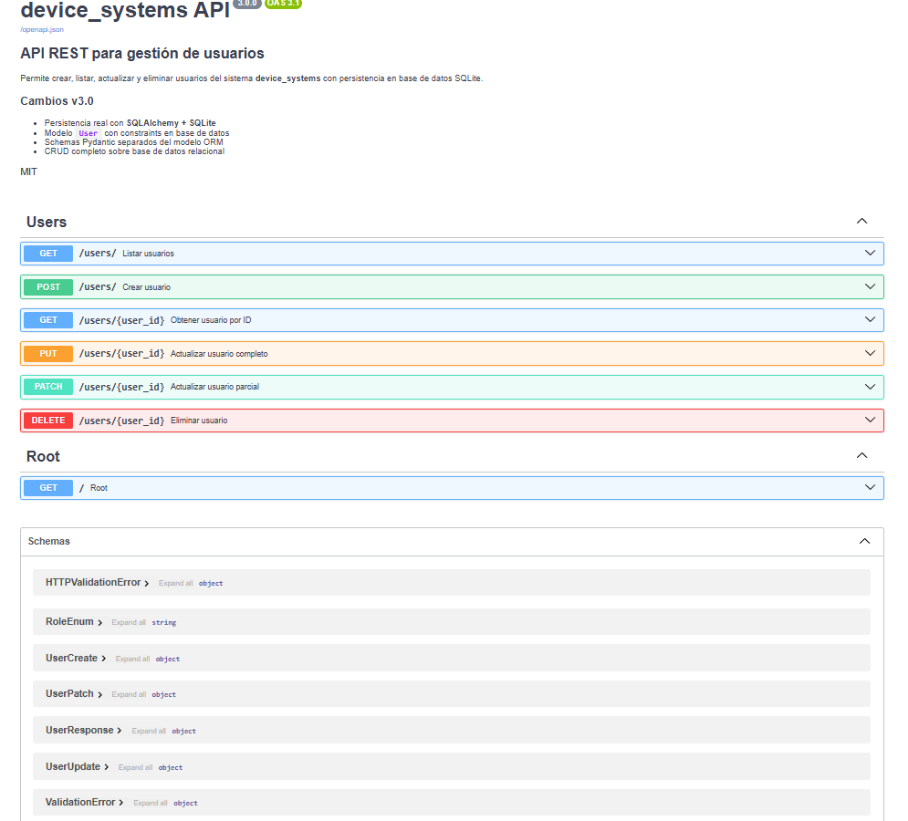

## Endpoints


## Prueba 1 - Crear usuario válido
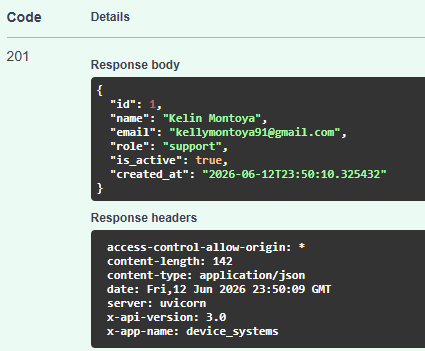

## Prueba 2 - Email duplicado (error 400)
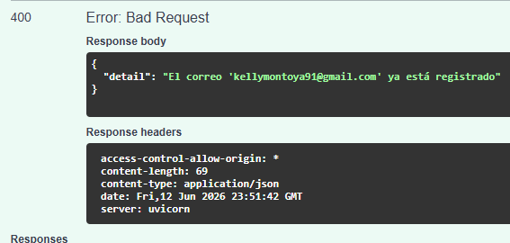

## Prueba 3 - Listar usuarios
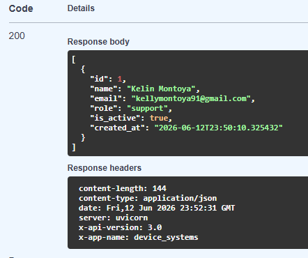

## Prueba 4 - Buscar por ID
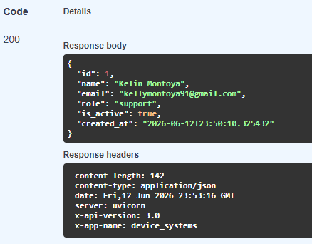

## Prueba 5 - Usuario no encontrado (error 404)
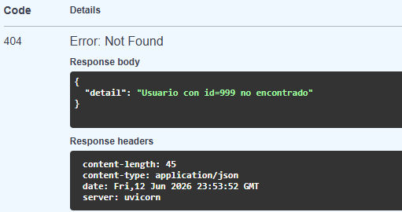

## Prueba 6 - Filtrar por rol
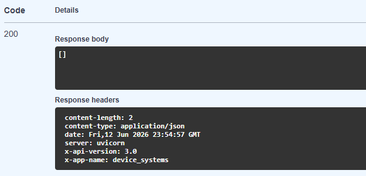

## Prueba 7 - Filtrar por estado
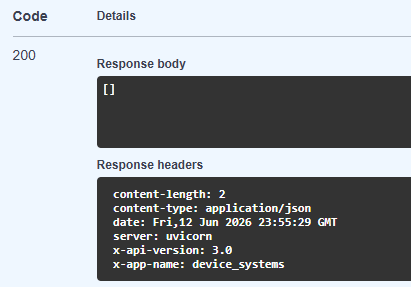

## Prueba 8 - PUT actualización completa
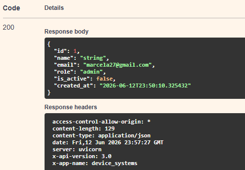

## Prueba 9 - PATCH actualización parcial
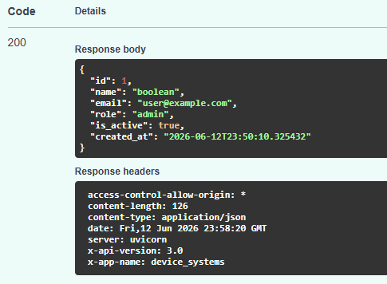

## Prueba 10 - DELETE eliminar usuario
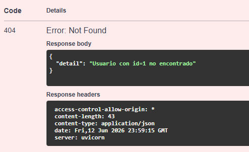

## Prueba 11 - Verificar usuario eliminado
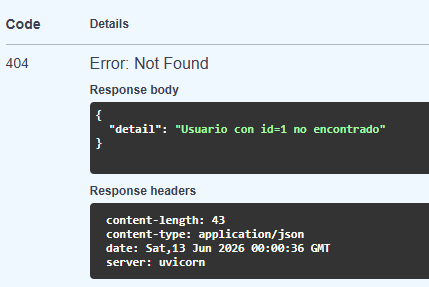


### Diferencia entre Modelo SQLAlchemy y Schema Pydantic
# Modelo SQLAlchemy (app/models/user_model.py)
- El modelo SQLAlchemy representa la tabla real en la base de datos. Es la clase que le dice a SQLAlchemy cómo crear la tabla users, qué columnas tiene, qué tipo de dato es cada una y qué restricciones aplica (por ejemplo que el email sea único o que el nombre no pueda estar vacío).
En otras palabras, el modelo es el "plano" de la tabla en la base de datos.
pythonclass User(Base):
    __tablename__ = "users"
    id        = Column(Integer, primary_key=True)
    name      = Column(String, nullable=False)
    email     = Column(String, unique=True, nullable=False)
    role      = Column(String, nullable=False)
    is_active = Column(Boolean, default=True)
    created_at = Column(DateTime, default=datetime.utcnow)

# Schema Pydantic (app/schemas/user_schema.py)
- El schema Pydantic se encarga de validar los datos que entran y salen de la API. Cuando alguien hace un POST, Pydantic revisa que el email tenga formato válido, que el nombre tenga mínimo 3 caracteres y que el rol sea uno de los permitidos. Si algo falla, la API responde automáticamente con un error 422.
En otras palabras, el schema es el "guardián" de los datos en la API.
pythonclass UserCreate(BaseModel):
    name:      str      = Field(..., min_length=3)
    email:     EmailStr
    role:      RoleEnum
    is_active: bool = True

# Tabla comparativa
Aspecto          | Modelo SQLAlchemy                   | Schema Pydantic
¿Para qué sirve? | Representa la tabla en la BD        | Valida datos de la API
¿Dónde actúa?    | En la base de datos                 | En el request y response
¿Qué valida?     | Constraints de BD(unique, nullable) | Reglas de negocio (min_length, email)
¿Quién lo usa?   | SQLAlchemy (ORM)                    | FastAPI (endpoints)

### Reflexión final sobre persistencia
Antes, los usuarios se guardaban en una lista de Python. Eso significa que cada vez que se reiniciaba el servidor, todos los datos se perdían. Con SQLAlchemy y SQLite, los datos quedan guardados en un archivo real (device_systems.db) y sobreviven al reinicio del servidor.
Además, la base de datos garantiza la integridad de los datos por su cuenta: aunque el código tuviera un error, la BD nunca permitiría dos usuarios con el mismo email gracias al constraint unique=True. Eso hace la aplicación mucho más confiable y lista para un entorno real.
Usar un ORM como SQLAlchemy también permite trabajar con objetos Python en lugar de escribir SQL directamente, lo que hace el código más limpio, más fácil de mantener y menos propenso a errores.