# device_systems API — v4.0 (Alembic + Relaciones + Joins)

API REST construida con **FastAPI**, **SQLAlchemy** y **Alembic** que gestiona
usuarios, dispositivos tecnológicos y préstamos entre ambos.

---

## Estructura del proyecto

```
device_systems/
│── app/
│   │── main.py
│   │
│   │── database/
│   │   └── connection.py
│   │
│   │── models/
│   │   │── __init__.py            # importa User, Device, Loan
│   │   │── user_model.py
│   │   │── device_model.py
│   │   └── loan_model.py
│   │
│   │── schemas/
│   │   │── user_schema.py
│   │   │── device_schema.py
│   │   └── loan_schema.py
│   │
│   │── routes/
│   │   │── user_routes.py
│   │   │── device_routes.py
│   │   └── loan_routes.py
│   │
│   │── services/
│   │   │── user_service.py
│   │   │── device_service.py
│   │   └── loan_service.py
│   │
│   └── dependencies/
│       └── database_dependency.py
│
│── alembic/
│   │── versions/
│   │   └── d169f21aeac6_create_users_devices_and_loans_tables.py
│   └── env.py
│
│── alembic.ini
│── requirements.txt
└── README.md
```

---

## Instalación y ejecución

```bash
pip install -r requirements.txt

# Aplicar migraciones (crea las tablas)
alembic upgrade head

# Levantar el servidor
python -m uvicorn app.main:app --reload
```

Documentación:
- **Swagger UI:** http://127.0.0.1:8000/docs
- **ReDoc:** http://127.0.0.1:8000/redoc

---

## Migraciones con Alembic

### Inicialización
```bash
alembic init alembic
```
Esto generó la carpeta `alembic/`, el archivo `alembic.ini` y `alembic/env.py`.

### Configuración
En `alembic.ini` se definió la URL de conexión:
```ini
sqlalchemy.url = sqlite:///./device_systems.db
```

En `alembic/env.py` se importó la `Base` y todos los modelos para que Alembic
detecte los cambios automáticamente:
```python
from app.database.connection import Base
from app.models import User, Device, Loan
target_metadata = Base.metadata
```

### Generar migración
```bash
alembic revision --autogenerate -m "create devices and loans tables"
```
Alembic detectó automáticamente las tablas `users`, `devices` y `loans`, sus
índices y las claves foráneas de `loans` hacia `users` y `devices`.

### Aplicar migración
```bash
alembic upgrade head
```

### Ver historial
```bash
alembic history
```
Salida:
```
<base> -> d169f21aeac6 (head), create users devices and loans tables
```

---

## Modelos y relaciones

### User (1) ── (N) Loan
Un usuario puede tener muchos préstamos.
```python
# user_model.py
loans = relationship("Loan", back_populates="user")
```

### Device (1) ── (N) Loan
Un dispositivo puede aparecer en muchos préstamos históricos.
```python
# device_model.py
loans = relationship("Loan", back_populates="device")
```

### Loan (N) ── (1) User / (N) ── (1) Device
Cada préstamo pertenece a un usuario y a un dispositivo.
```python
# loan_model.py
user_id   = Column(Integer, ForeignKey("users.id"), nullable=False)
device_id = Column(Integer, ForeignKey("devices.id"), nullable=False)

user   = relationship("User", back_populates="loans")
device = relationship("Device", back_populates="loans")
```

---

## Endpoints disponibles

### Users
| Método | Ruta                  | Descripción                          |
|--------|-----------------------|---------------------------------------|
| GET    | /users                | Listar usuarios                       |
| GET    | /users/{id}           | Buscar por ID                         |
| POST   | /users                | Crear usuario                         |
| PUT    | /users/{id}           | Actualizar completo                   |
| PATCH  | /users/{id}           | Actualizar parcial                    |
| DELETE | /users/{id}           | Eliminar                              |
| GET    | /users/{id}/loans     | Préstamos del usuario (JOIN)          |

### Devices
| Método | Ruta                    | Descripción                         |
|--------|-------------------------|---------------------------------------|
| GET    | /devices                | Listar (filtros: device_type, is_available, brand, search) |
| GET    | /devices/{id}           | Buscar por ID                       |
| POST   | /devices                | Crear dispositivo                   |
| PUT    | /devices/{id}           | Actualizar completo                 |
| PATCH  | /devices/{id}           | Actualizar parcial                  |
| DELETE | /devices/{id}           | Eliminar                            |
| GET    | /devices/{id}/loans     | Historial de préstamos (JOIN)       |

### Loans
| Método | Ruta                     | Descripción                                  |
|--------|--------------------------|-----------------------------------------------|
| GET    | /loans                   | Listar (filtros: status, user_id, device_id, user_email, device_type) |
| GET    | /loans/details           | Listar con datos de usuario y dispositivo (JOIN) |
| GET    | /loans/{id}              | Detalle de un préstamo (JOIN)                |
| POST   | /loans                   | Crear préstamo (valida usuario, dispositivo y disponibilidad) |
| PATCH  | /loans/{id}/return       | Devolver dispositivo                         |

---

## Consultas con joins y filtros

`loan_service.get_all_loans()` combina las tres tablas:

```python
query = (
    db.query(Loan)
    .join(User, Loan.user_id == User.id)
    .join(Device, Loan.device_id == Device.id)
    .options(joinedload(Loan.user), joinedload(Loan.device))
)
```

Filtros aplicados con `and_()` y `ilike()`:
```python
filters = []
if status:      filters.append(Loan.status == status)
if user_email:  filters.append(User.email.ilike(f"%{user_email}%"))
if device_type: filters.append(Device.device_type == device_type)
query = query.filter(and_(*filters))
```

Ejemplo de respuesta de `GET /loans/details`:
```json
{
  "loan_id": 1,
  "status": "active",
  "user": {
    "id": 1,
    "name": "Ana Pérez",
    "email": "ana@sena.edu.co"
  },
  "device": {
    "id": 3,
    "name": "Laptop Lenovo ThinkPad",
    "serial_number": "LEN-2024-001",
    "device_type": "laptop"
  }
}
```

---

## Reglas de negocio en préstamos

**POST /loans**
1. Verifica que el usuario exista → si no, `404`
2. Verifica que el dispositivo exista → si no, `404`
3. Verifica que el dispositivo esté disponible → si no, `409`
4. Crea el préstamo con `status="active"`
5. Marca `device.is_available = False`

**PATCH /loans/{id}/return**
1. Verifica que el préstamo exista → si no, `404`
2. Verifica que no esté ya devuelto → si lo está, `409`
3. Cambia `status="returned"` y asigna `return_date`
4. Marca `device.is_available = True`

---

## Manejo de errores

| Caso                              | Código |
|-----------------------------------|--------|
| Registro creado                   | 201    |
| Consulta exitosa                  | 200    |
| Devolución exitosa                | 200    |
| Eliminación exitosa               | 204    |
| Recurso no encontrado             | 404    |
| Dato duplicado (email/serial)     | 400    |
| Regla de negocio incumplida       | 409    |
| Error de validación (Pydantic)    | 422    |

---
## CAPTURAS

## Estructura de tablas generadas
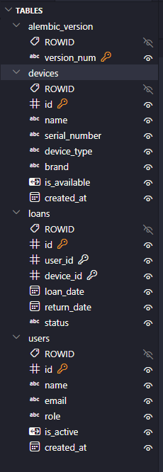

## Migraciones con Alembic

### alembic revision --autogenerate


### alembic upgrade head


### alembic history


## Swagger UI

### Documentación general
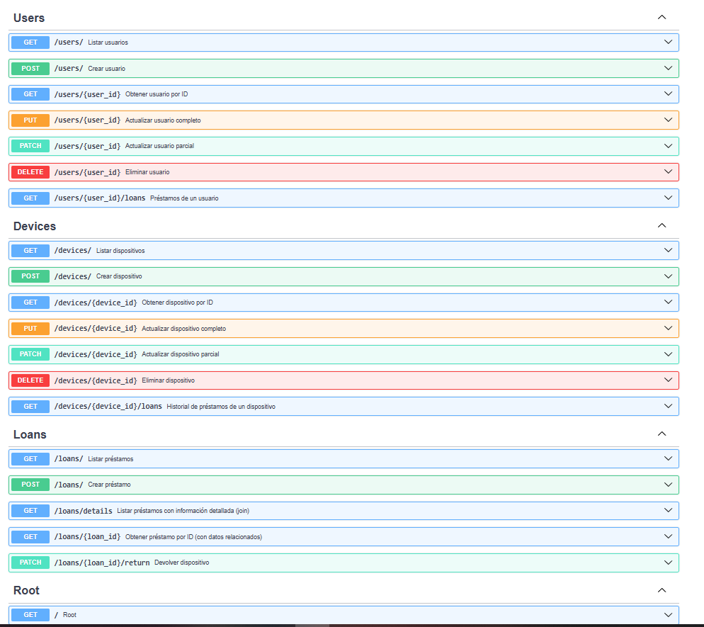

### Endpoints de Devices
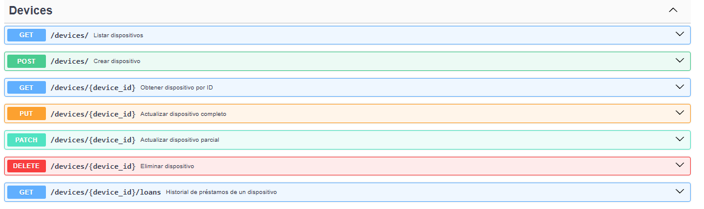

### Endpoints de Loans
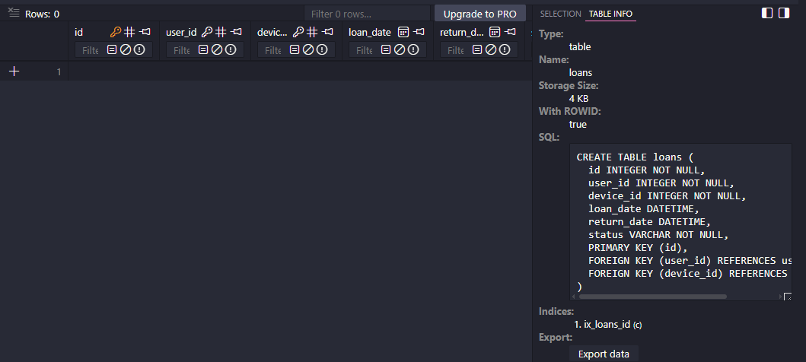

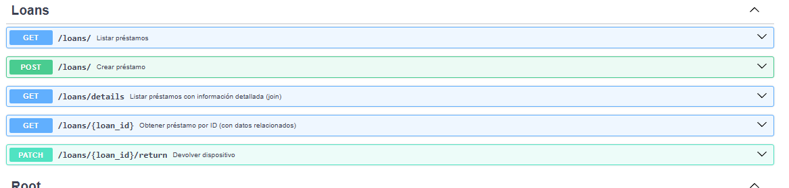

## Pruebas funcionales

### Prueba 1
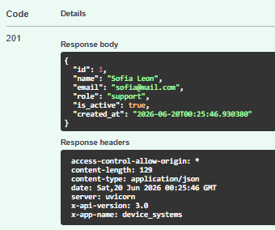

### Prueba 2
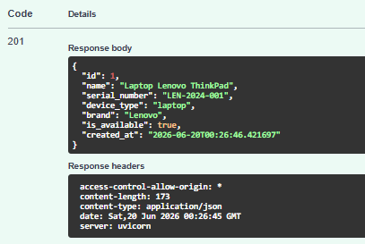

### Prueba 3
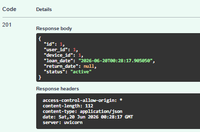

### Prueba 4
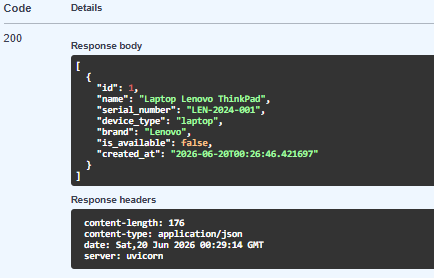

### Prueba 5
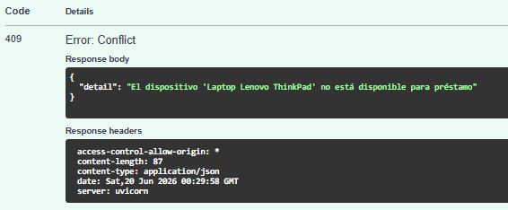

### Prueba 6
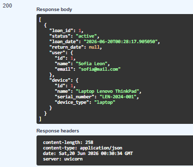

### Prueba 7
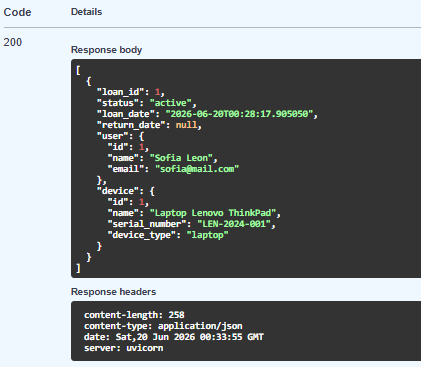

### Prueba 8
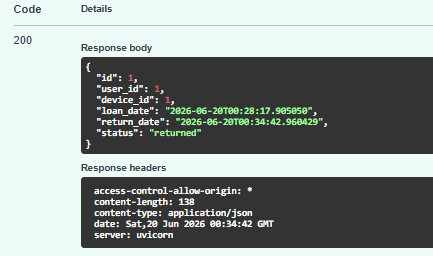

### Prueba 9
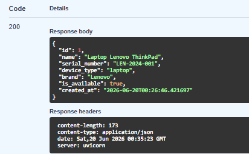

### Prueba 10
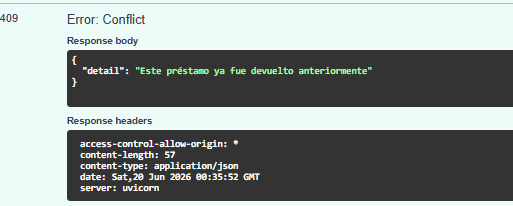

### Prueba 11
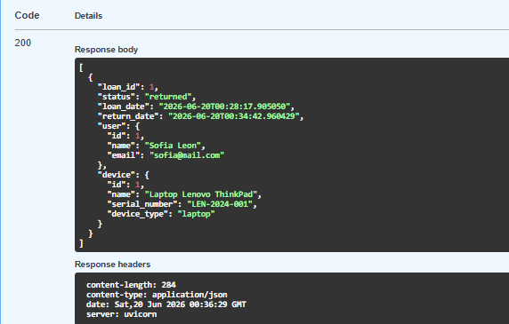

## Modelo SQLAlchemy vs Schema Pydantic

| Aspecto | Modelo SQLAlchemy | Schema Pydantic |
|---|---|---|
| ¿Para qué sirve? | Representa la tabla en la BD | Valida datos de la API |
| ¿Dónde actúa? | En la base de datos | En el request y response |
| ¿Qué valida? | Constraints de BD (unique, nullable, FK) | Reglas de negocio (min_length, email, enums) |
| ¿Quién lo usa? | SQLAlchemy (ORM) | FastAPI (endpoints) |

---

## Reflexión final

**Sobre migraciones:** Antes de Alembic, cualquier cambio en los modelos exigía
borrar la base de datos y recrearla desde cero, perdiendo todos los datos. Con
Alembic, cada cambio estructural queda versionado en un archivo de migración
que se puede aplicar (`upgrade`) o revertir (`downgrade`) de forma controlada,
igual que se versiona el código fuente con Git.

**Sobre las relaciones:** Modelar `User`, `Device` y `Loan` como tablas
relacionadas en lugar de mezclar todo en una sola tabla permite mantener la
integridad de los datos: un préstamo nunca puede existir sin un usuario y un
dispositivo válidos gracias a las claves foráneas (`ForeignKey`).

**Sobre los joins:** Las consultas con `join()` y `joinedload()` permiten
traer información relacionada de varias tablas en una sola consulta eficiente,
evitando hacer múltiples llamadas separadas a la base de datos y entregando al
cliente de la API respuestas ya enriquecidas con el contexto que necesita.

---

*Rama de desarrollo: `device_systems_alembic_relaciones` — incorpora Alembic, modelos relacionados (Device, Loan) y consultas con joins.*
